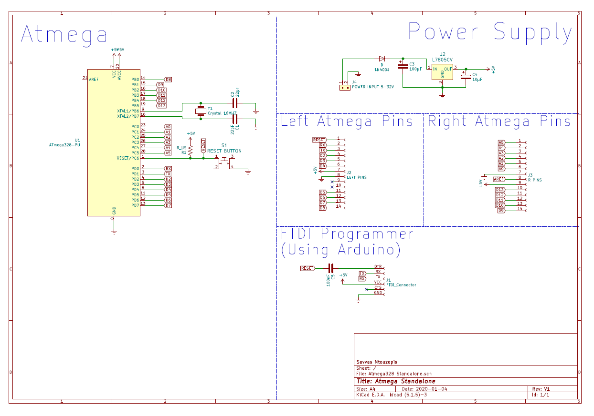

# Atmega Standalone 

In this repository you can learn how to use Atmega328 standalone without Arduino board.

Also you will find photos and schematics of my Atmega Board that I build on a prototype board.

My Atmega Board 

Schematic

=======
I built an "Arduino" board using the Atmega328.
I did that to learn how to use Atmega Standalone,to implement the microcontroller
into a project without the use of an Arduino Board.

**Disclaimer:**

This is a guide I wrote to document what I did to build my own "Arduino" board .

The guide contains my research about this topic and what I learned in the process of making the board.

Thank you

